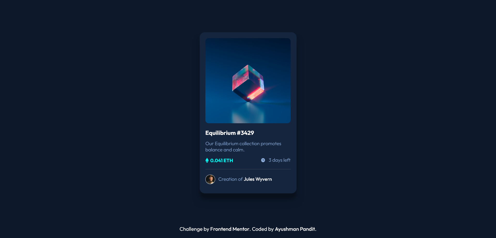

# Frontend Mentor - NFT preview card component solution

This is a solution to the [NFT preview card component challenge on Frontend Mentor](https://www.frontendmentor.io/challenges/nft-preview-card-component-SbdUL_w0U). Frontend Mentor challenges help you improve your coding skills by building realistic projects.

## Table of contents

-   [Overview](#overview)
    -   [The challenge](#the-challenge)
    -   [Screenshot](#screenshot)
    -   [Links](#links)
-   [My process](#my-process)
    -   [Built with](#built-with)
    -   [What I learned](#what-i-learned)
    -   [Continued development](#continued-development)
-   [Author](#author)

## Overview

### The challenge

Users should be able to:

-   View the optimal layout depending on their device's screen size
-   See hover states for interactive elements

### Screenshot

### Links

-   Solution URL: (https://github.com/AyushmanPandit/NFT-Preview-Card-Component)
-   Live Site URL: (https://ayushmanpandit.github.io/NFT-Preview-Card-Component/)

## My process

-   Reviewed the given preview and design images for desktop, mobile and the active states
-   Planned out my actions that were required to build the webpage
-   Wrote the semantic html for the webpage
-   Checked the give style guide and imported the required fonts and colors for the webpage
-   Styled the elements one by one until satisfied, then moved on to the next to match the desktop and mobile designs
-   Added the active states and the hover states
-   Finally, Compared the webpage to the original and made minute changes to make it look as similar to the original as possible

### Built with

-   Semantic HTML5 markup
-   CSS custom properties
-   Flexbox

### What I learned

Polished my HTML5 and CSS skills further with this project and learned how to write cleaner and more efficient code.
Also learned how to add an overlay hover effect to an image

### Continued development

Slowly getting more comfortable with layout challenges using flexbox. Wish to continue practicing flexbox and grid until completely confident in those fields.

## Author

-   Frontend Mentor - [@AyushmanPandit](https://www.frontendmentor.io/profile/AyushmanPandit)
